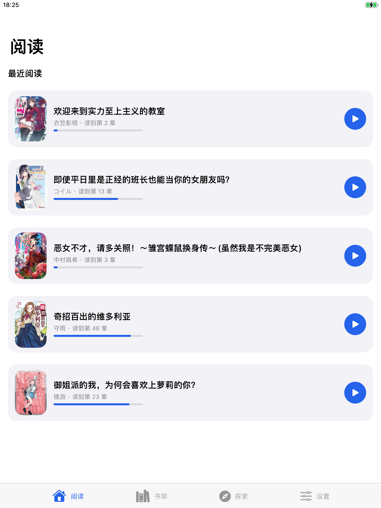
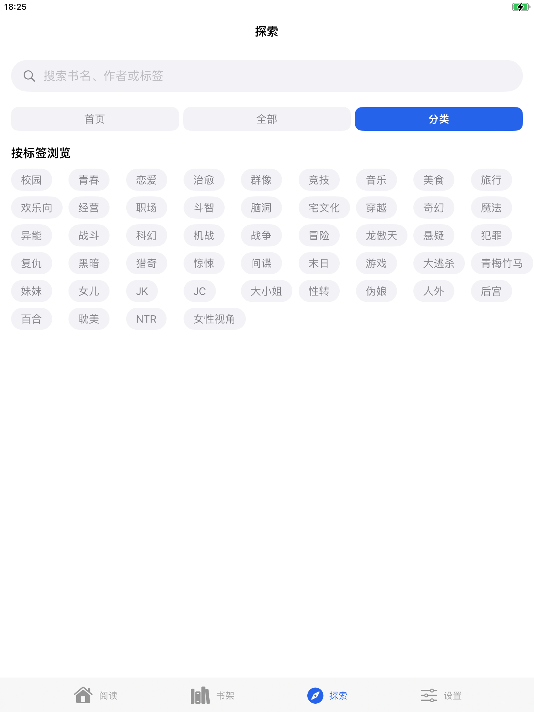
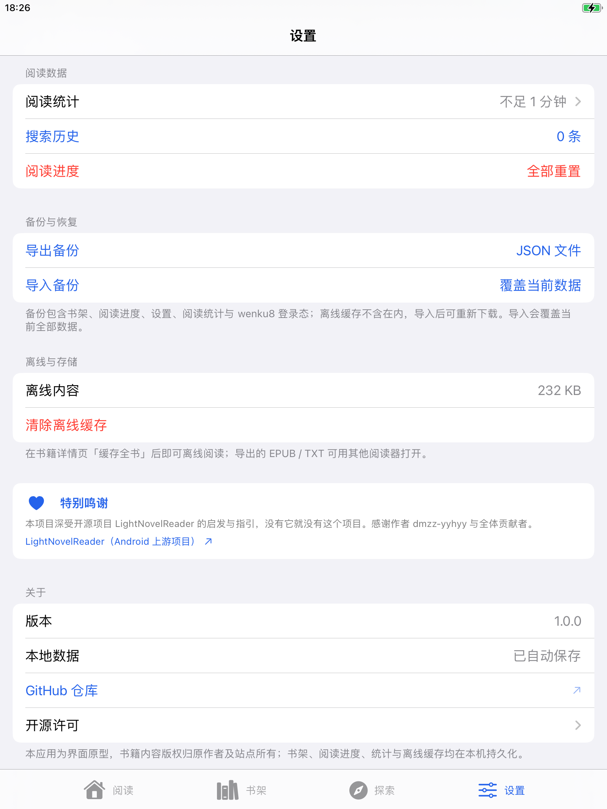

**简体中文** | [繁體中文](README_TW.md) | [English](README_US.md) | [Русский](README_RU.md)

<div align="center">
    
    <h1>LightNovelReader (iOS)</h1>
    <a></a>
    <a></a>
    <a></a>
    <p>以 SwiftUI 編寫的 iOS 輕小說閱讀器，支援 iPhone 與 iPad</p>
</div>

## 介紹

LightNovelReader (iOS) 是一款開源的輕小說閱讀軟體，使用 Swift 與 SwiftUI 編寫，支援 iPhone 與 iPad。介面與互動參考 Android 版 [LightNovelReader](https://github.com/dmzz-yyhyy/LightNovelReader) 實作。

> ### ❤️ 特別鳴謝
>
> **本專案深受開源專案 [LightNovelReader](https://github.com/dmzz-yyhyy/LightNovelReader) 的啟發與指引，沒有它就沒有本專案。**
> 感謝作者 [dmzz-yyhyy](https://github.com/dmzz-yyhyy)（夜魚很業餘）與全體貢獻者的傑出工作與無私開源。

## 特性

- 真實書源：線上瀏覽、搜尋與閱讀
- 閱讀器：仿真捲曲翻頁、捲動模式，字型/字號/行距/背景自由調整，OLED 純黑夜間模式
- 書架：多書架管理，收藏與更新提醒
- 離線快取：全書下載，離線可讀
- 匯出：EPUB / TXT
- 閱讀統計：時長累計與熱力圖

## 軟體截圖

| | | |
|---|---|---|
|  |  |  |
|  |  |  |
|  | | |

## 下載

從 [GitHub Releases](https://github.com/komorebiiluvu/LightNovelReader-For-IOS/releases/latest) 下載最新發布版。發布包為未簽名的 `.ipa` 檔案，需自行簽名後安裝（可使用愛思助手、Sideloadly 等工具）。

## 支援

- 在 [**此處**](https://github.com/komorebiiluvu/LightNovelReader-For-IOS/issues/new/choose) 提交 Bug 回饋或新功能請求
- 聯絡作者：**QQ：`3662909214`**

## License

```
Copyright (C) dmzz-yyhyy (夜魚很業餘) and contributors of LightNovelReader
Copyright (C) 2026 komorebiiluvu (iOS Port)

   Licensed under the Apache License, Version 2.0 (the "License");
   you may not use this file except in compliance with the License.
   You may obtain a copy of the License at

       http://www.apache.org/licenses/LICENSE-2.0

   Unless required by applicable law or agreed to in writing, software
   distributed under the License is distributed on an "AS IS" BASIS,
   WITHOUT WARRANTIES OR CONDITIONS OF ANY KIND, either express or implied.
   See the License for the specific language governing permissions and
   limitations under the License.
```

完整授權文本見 [LICENSE](LICENSE)，內建字型的授權見 [THIRD_PARTY_NOTICES.md](THIRD_PARTY_NOTICES.md)。

## 免責聲明

本應用僅為個人閱讀工具，不提供、不儲存任何小說內容；所有內容版權歸原作者及站點所有，請支持正版。
